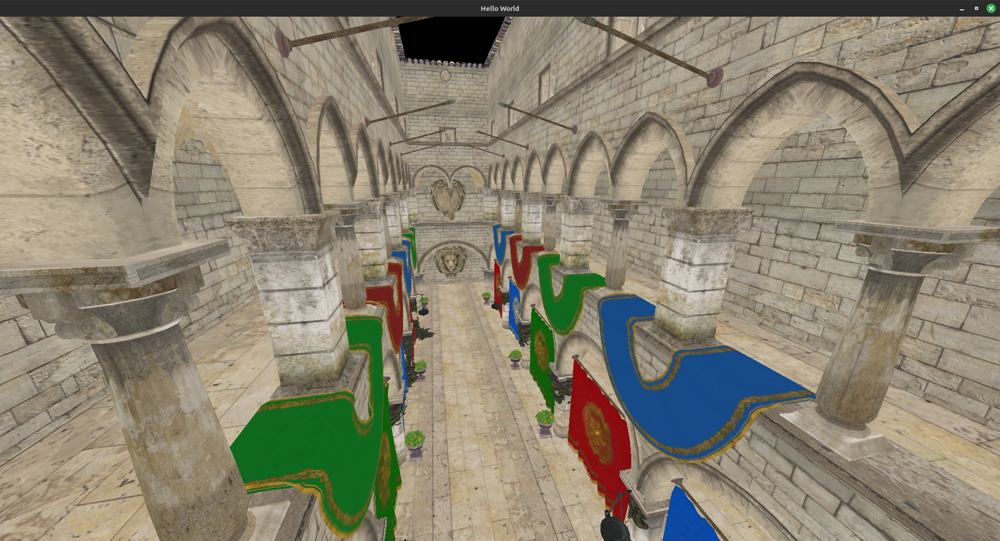

Author: Mason Hawver

# Compiling & Running it

```
mkdir build
cmake -B build
cd build
make
./aaa_main
```

# Gallery



# Todo

 - [X] texture loading
 - [X] model loading / compression
 - [X] Debug shapes
  - [ ] add opacity
 - [X] Multiple Objects
 - [ ] frame buffer / deferred rendering - to display depth data [two hours]
 - [ ] save buffer to disk - [an hour]
 - [ ] BVH to test if point is inside
 - [ ] directional lights
 - [ ] update materials for blin phong shadding
   - [ ] specular maps / optional maps
 - [ ] SSAO
 - [ ] generate trajectories with Metropolis hastings samplings
 - [ ] debug axis to move objects around [couple days]


Latter:
 - [ ] lights and Blinn-Phong Shading
 - [ ] directional shadows
 - [ ] compute shader fun ???
   - [ ] Forward Rendering
   - [ ] Grass / FFT Ocean / Water Sim / Particles
 - [ ] Scene Graph