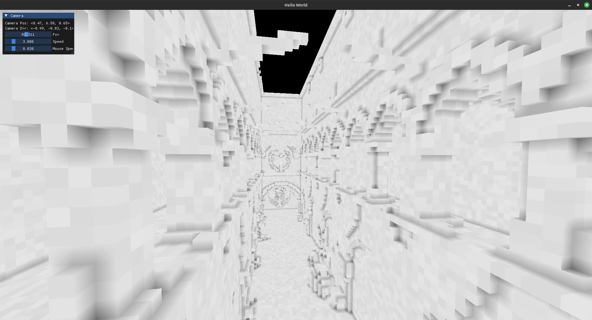
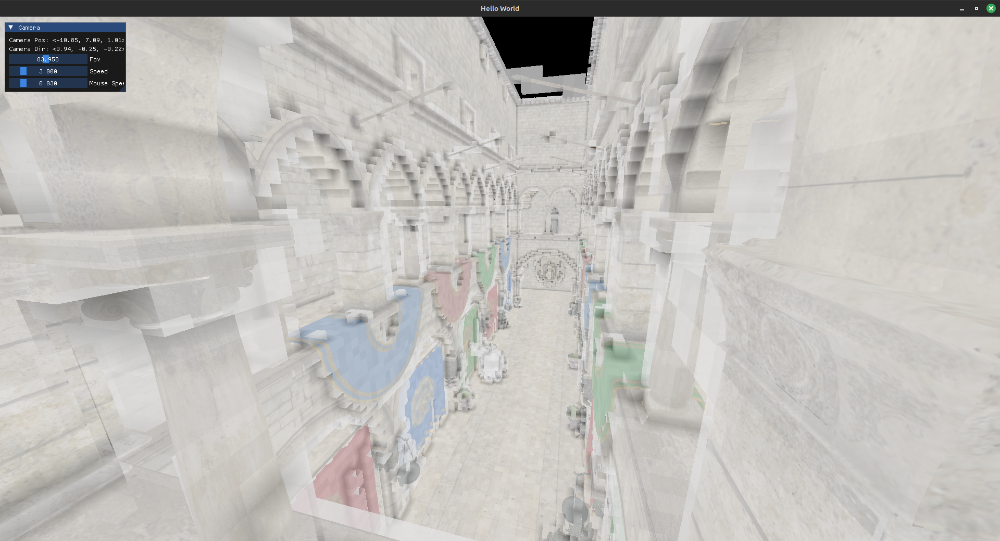
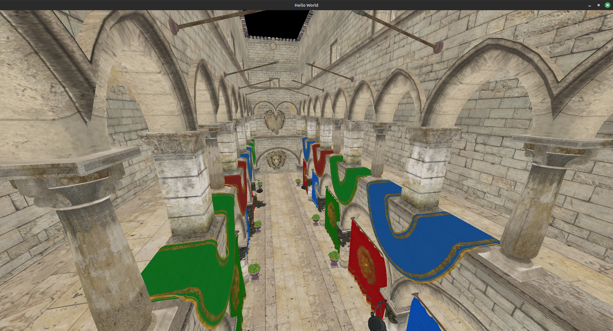

# CV Project : carthage

**Author**: Mason Hawver \
**Email**: hawve005@umn.edu

## Install, Compile, and Run 

```
sudo apt install build-essential cmake libglu1-mesa-dev freeglut3-dev  mesa-common-dev libxkbcommon-dev
git submodule update --init --recursive
mkdir build
cmake -B build
cd build
make
./main
```

## Gallery

 
 

<details>

<summary>Old Snapshots</summary>

 

</details>

## Documentation

| File Name | File Description                                                 | Dependencies |
|-----------|------------------------------------------------------------------|--------------|
| data      | Textures, 3d models, shaders, and files created by programs | | 
| ext | Source code for external libraries. | |
| ext/glad | opengl api. |
| ext/glfw | cross platform windowing api. |
| ext/glm  | matrix math library. |
| ext/imgui | api agnostic immediate mode gui library. |
| ext/stb | image loading library. |
| ex/tinyobjloader | object loading library |
| src       | Source code for this project | |
| src/main.cpp | Loads a scene then allows the user to control a free cam. | glad glfw imgui src/game src/graphics src/resources |
| src/obj.cpp | Compresses a .obj file into a .bin file. | src/game src/resources | 
| src/core | project's core library, implements a pool and octree data structure | |
| src/graphics | project's graphics api for open-gl, isolated glad; use still requires an understanding of open-gl. | glad | 
| src/game | project's main library for high level abstractions. | std glm src/graphics src/core |
| src/resources | project's io library. | stb tinyobjloader src/game src/graphics |
| tmp | old code thats deprecated, but may still be useful | |  
| scripts   | Python and Bash scripts that perform tasks: scene creation, obj compression, and etc | built executables | 
| CMakeLists.txt | cmake file for building the code in src and ext | | 

For a further understanding read the code or email hawve005@umn.edu.

## Todo

- [X] texture loading
- [X] model loading / compression
- [X] Debug shapes
- [X] Multiple Objects
- [X] Scene files
- [X] Build Octree
- [X] Render Octree
    - [ ] make it more efficient
- [ ] Fix debug renderer with new knowlage
- [ ] A* Octree (in prog)
- [ ] Theta* path -> calc 
<!-- - [ ] Metropolis Hastings Trajectory sampling (end of the week target) -->
- [ ] Frame Buffer stream
<!-- - [ ] Data-gen pipeline -->
- [ ] Add Documentation (in prog)
- [ ] Fork for CV

## Data Pipeline

| Proc | Lang |
|------|------|
|.obj -> .bin  | c++  (Done) |
|.bin -> .scene    | python (Sponza Done | Forest Todo | ...) |
|.scene -> .octree | python (Done) |
|.octree .bin .scene -> data (Todo) | c++ |
|data -> cnn | python (Big Todo) |
|cnn -> inferance | c++ (Big Todo) |

